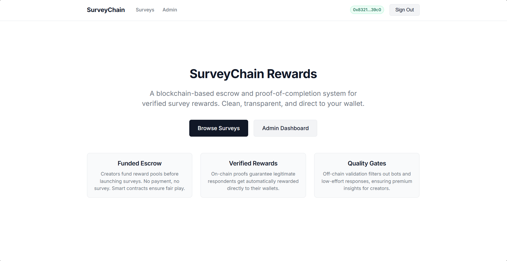

# SurveyChain Rewards

Blockchain-based escrow and proof-of-completion dApp for verified survey rewards on **Ethereum Sepolia**.

## Repository Link
- GitHub: `https://github.com/ClydeTeia/blockchain-finals`

## Project Description
SurveyChain Rewards is an academic cryptography/blockchain project that combines:
- Smart-contract reward escrow
- Wallet-signature authentication
- Demo KYC verification flow
- Off-chain response quality checks
- Backend-signed EIP-712 completion proofs
- On-chain claimable reward withdrawals

Sepolia-only scope:
- Network: Sepolia Testnet
- Currency: Sepolia ETH only (not real money)

## Tech Stack
- Next.js + TypeScript App Router (`web/`)
- Next.js Route Handlers (`web/app/api/**/route.ts`)
- Hardhat + TypeScript (`contracts/`)
- ethers.js v6
- Supabase Postgres + Storage (`supabase/`)
- MetaMask

## Setup and Installation
From repository root:

```powershell
pnpm install
```

Environment files:
- Copy `web/.env.example` and `contracts/.env.example`
- Fill required values for local development

Important:
- Do not commit real `.env` secrets.
- Server-only secrets must stay server-side.

## Run Locally
### Web app
```powershell
cd web
pnpm dev
```
Default: `http://localhost:3000`

### Contracts
```powershell
cd contracts
pnpm build
```

## Run Hardhat Tests
```powershell
cd contracts
pnpm test
```

Or from root:
```powershell
pnpm test
```

## Deployed Contract
- Network: `Sepolia`
- Contract Address: `0xd44964682B6a86C02a9743A67f37388Fa2303CD3`
- Etherscan: `https://sepolia.etherscan.io/address/0xd44964682B6a86C02a9743A67f37388Fa2303CD3`

## Deployed Site URL
- Live Frontend URL: `https://blockchain-finals.vercel.app/`

## App Screenshot


## MetaMask + Contract Interaction
The app is designed to:
- Connect wallet via MetaMask
- Enforce Sepolia network
- Submit and validate survey completion proofs
- Interact with deployed contract state and reward claims

## API Overview
- Auth:
  - `POST /api/auth/nonce`
  - `POST /api/auth/verify`
  - `POST /api/auth/logout`
  - `GET /api/auth/me`
- Survey/answer flow:
  - `GET /api/surveys`
  - `GET /api/surveys/:id`
  - `GET /api/surveys/:id/quality-rules`
  - `POST /api/surveys/:surveyId/start-attempt`
  - `POST /api/answers/submit`
  - `POST /api/answers/:id/refresh-proof`
  - `POST /api/answers/:id/mark-onchain-confirmed`
  - `GET /api/answers/my`
- KYC/admin:
  - `POST /api/kyc/submit`
  - `GET /api/kyc/status`
  - `GET /api/admin/kyc-requests`
  - `POST /api/admin/kyc/:id/signed-urls`
  - `POST /api/admin/kyc/:id/approve`
  - `POST /api/admin/kyc/:id/reject`

## Validation Commands
From repository root:

```powershell
pnpm lint
pnpm typecheck
pnpm test
pnpm build
```

## Credits and References
Add all external references used by the team.

- Next.js docs: https://nextjs.org/docs
- Hardhat docs: https://hardhat.org/docs
- ethers.js docs: https://docs.ethers.org/
- OpenZeppelin docs: https://docs.openzeppelin.com/contracts
- Supabase docs: https://supabase.com/docs
- AI tools used: ChatGPT/Codex (OpenAI), Claude, KiloCode Free AI Models

## Notes
- Current repository status and phase tracking are documented in:
  - `docs/execution-plans/active/surveychain-implementation-plan.md`
  - `docs/integration-validation-report.md`
